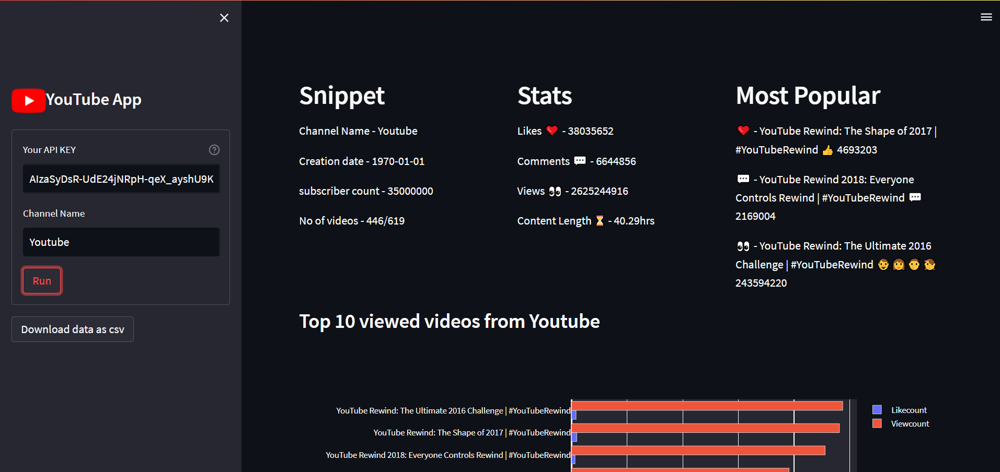
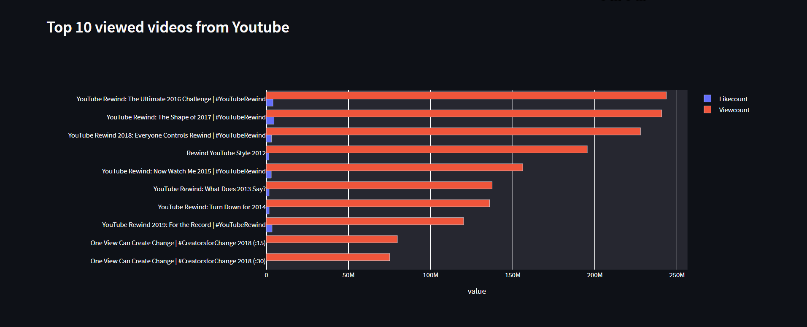
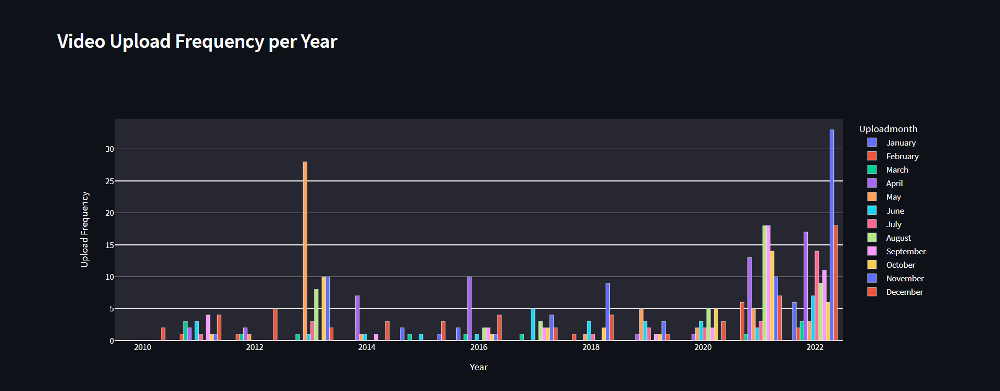

[live](https://youtube-channel-analyser.streamlit.app/)


# Insightify

## Description
This application retrieves YouTube channel metadata using the YouTube Data API V3 and provides an exploratory data analysis of the channel. It requires a YouTube API key and the channel name as inputs. The data is collected via the YouTube API, transformed using pandas, and visualized with Streamlit.

## Features
- All time channel stats
  - Total Likes
  - Total comments
  - Total views
  - Total content length
- All time top videos
  - Most liked
  - Most Viewed
  - Most commented
- Data can be downloaded in csv form 

## Quick glance at the results





## Run Locally
Initialize git
```
git init
```
Clone the project
```
git clone https://github.com/Bhagya2506/Insightify.git
```
enter the project directory
```
cd Insightify
```
Create a virtual environment and install all the packages from the environment.yml (recommended)
```
python -m venv .venv
```
Activate the virtual environment
```
.venv/Scripts/Activate.ps1
```
install required packages
```
pip install -r requirements.txt
```
start the streamlit server locally
```
streamlit run main.py
```
